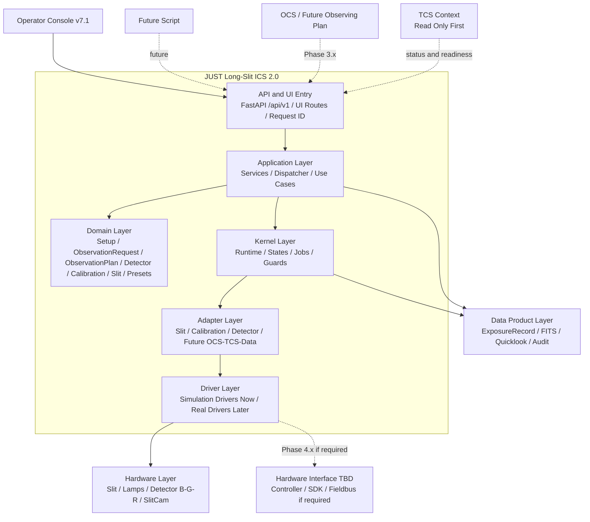

# JUST Long-Slit ICS 2.0 软件开发战略

```text
文档日期: 2026-05-29
版本: v2026.05.29-r3
状态: Phase 2.9-A closed; post-2.9-A maintenance fixes closed; Phase 2.9-B1 next
适用范围: JUST 长缝光谱仪 ICS 2.0 软件主线开发
当前 mainline checkpoint before this docs sync: a955308 ui: clarify calibration mode lamp frame coupling
当前验证: pytest -q -> 202 passed in 1.40s
```

## 1. 战略定位

JUST Long-Slit ICS 2.0 是 JUST 长缝光谱仪的软件控制骨架。它不是“一个网页 GUI”，也不是“单个硬件驱动程序”，而是位于观测控制、望远镜状态、仪器机构、探测器、定标系统、数据产品之间的仪器控制系统。

当前主线采用：

```text
simulation-first
API-first
contract-first
operator-safe UI
explicit audit trail
adapter-bounded hardware integration
```

长期目标链路是：

```text
OCS / Operator / Future Script
  -> ObservationRequest / ObservationPlan
  -> ICS validation and readiness
  -> SequenceStep execution
  -> Slit / calibration / detector / TCS-readiness coordination
  -> ExposureRecord / DataProduct / Quicklook
  -> Lifecycle event stream
  -> Result callback / audit log
  -> Safe abort and recovery
```

这条链路是方向，不是当前阶段一次性实现的范围。当前阶段要做的是把后续链路需要的领域合同、API 合同、状态语义和审计边界逐步定稳。

## 2. 软件边界

### 2.1 ICS 负责什么

ICS 2.0 应负责：

```text
- 暴露稳定的 /api/v1/* 控制与状态接口；
- 维护仪器状态、曝光状态、子系统状态和 latest_job / request_id 审计链；
- 管理 setup/session context、slit、calibration、detector、presets、observation 等仪器控制语义；
- 提供 operator console，用于 routine observing、diagnostics、future engineer views；
- 通过 adapter/driver 边界接入模拟硬件与未来真实硬件；
- 将观测动作、观测结果、数据产品元数据和错误记录统一表达；
- 为 OCS、TCS、DataProduct、Quicklook、SequenceRunner、真实硬件集成预留合同。
```

### 2.2 ICS 不负责什么

ICS 2.0 不应越界承担以下职责：

```text
- 不负责改变光谱仪的光学分辨率本身；
- 不负责替代 OCS scheduler 或完整观测计划系统；
- 不负责替代 TCS 控制望远镜、调焦、转台、圆顶、天气权限等；
- 不负责在 routine operator UI 中暴露底层总线、PLC、motion-controller 或厂商 SDK 级控制；
- 不负责完整科学数据处理和光谱归约；
- 不负责在无硬件环境下伪造真实硬件 telemetry；
- 不负责把 placeholder 包装成 production capability。
```

`R >= 1000 @ 1 arcsec`、可调分辨率、波长覆盖、线性色散等是光学和仪器设计约束。软件可以记录配置、校验状态、保存 FITS/header 相关元数据、触发定标、辅助 QA，但软件本身不能“实现”光谱分辨率。

底层硬件通信协议不在当前软件阶段预先指定。真实硬件未来可能使用串口、USB、以太网、厂商 SDK、PLC/fieldbus、EPICS IOC 或其他控制接口；ICS 2.0 的战略目标是保留 adapter/gateway 边界，而不是提前把任何具体协议写成路线图主轴。

## 3. 架构护栏

后续每个 phase、PR、commit 都应通过以下检查：

| 护栏 | 判断问题 | 目的 |
|---|---|---|
| Contract first | 这个改动是在稳定领域/API 合同，还是只是在堆 UI/实现细节？ | 防止 UI 先行导致后端语义混乱 |
| Simulation parity | 真实硬件未来接入时，sim 路径还能保持同一合同吗？ | 防止 real-only hack |
| No telescope overreach | 是否越过 OCS/TCS 控制 pointing、rotator、guiding、dome、weather 或 telescope authority？ | 防止 ICS 越界 |
| No fake capability | 是否把 placeholder 包装成真实能力？ | 防止现场使用时误判 |
| Auditable command lifecycle | 高影响操作是否有 request_id、latest_job、result、error？ | 防止不可追踪操作 |
| Layer boundary | domain/application/kernel/api/ui/adapter 是否各司其职？ | 防止代码后期无法维护 |

这些护栏对 Phase 2.9-B 尤其重要：ObservationRequest / ObservationPlan 是后续 OCS、SequenceRunner、DataProduct 的上游合同，不能因为 UI 或脚本调用方便而变成一组松散参数。

## 4. 技术采纳门槛

任何新技术、协议、数据库、消息系统、实时框架、硬件总线、外部平台进入主路线图前，必须通过 Technology Adoption Gate。

```text
1. 它解决的当前项目问题是什么？
2. 这个问题是否已经在当前 phase 出现？
3. 是否有真实硬件、真实运维、真实接口合同支撑？
4. 是否可以先用更简单的 schema / simulator / file contract / adapter 解决？
5. 是否破坏当前 Domain / Kernel / Application / Adapter 分层？
6. 是否会让 routine operator UI 暴露底层工程复杂度？
7. 是否能被 pytest 或 integration test 覆盖？
8. 如果不用它，当前 phase 是否仍可推进？
```

判定规则：

```text
- 如果第 2、3、7 项不能回答清楚，不进入当前 phase。
- 如果只是未来可能需要，写成 TBD 或 candidate。
- 如果只是底层实现可能性，写成 adapter/gateway boundary。
- 战略文档优先写能力合同，不预设实现技术。
```

## 5. 当前主线基线

### 5.1 UI 路由

```text
/ui        -> v7.1 default operator-console prototype
/ui/v7     -> v7.1 explicit operator-console prototype
/ui/v5     -> v5 stable legacy fallback
/ui/legacy -> v5 stable legacy fallback alias
/ui/v6     -> v6 operational-status review shell
```

v7.1 当前信息架构为：

```text
Setup
Instrument / Configure
Observe
Presets
Diagnostics
Housekeeping
Engineer
```

核心原则：

```text
HTML owns durable structure.
Runtime JS enhances durable HTML skeletons.
```

v7 runtime 仍然 opt-in。Setup runtime 也遵守同样策略：`JUSTLS_UI_V7_RUNTIME_ENABLED=1` + `JUSTLS_UI_V7_SETUP_RUNTIME_ENABLED=1` 才注入 `setup_runtime.js`。

### 5.2 后端 API 基线

当前 backend 以 `/api/v1/*` 为主线，主要接口包括：

```text
GET  /api/v1/health
GET  /api/v1/status
GET  /api/v1/status/full
GET  /api/v1/capabilities

GET  /api/v1/setup/context
PUT  /api/v1/setup/context
POST /api/v1/setup/context/reload

POST /api/v1/slit
POST /api/v1/slit_angle

GET  /api/v1/calibration/status
POST /api/v1/calibration/mode
POST /api/v1/calibration/lamp

GET  /api/v1/detector/config
POST /api/v1/detector/config

GET  /api/v1/observation/status
POST /api/v1/observation/arm
POST /api/v1/observation/start
POST /api/v1/observation/finish
POST /api/v1/observation/stop_readout
POST /api/v1/observation/abort_discard

GET  /api/v1/presets
POST /api/v1/presets/preview
POST /api/v1/presets/apply
```

Observation router 当前覆盖 single-exposure lifecycle。Phase 2.9-B 的目标不是替换这些 endpoint，而是在其上游定义 ObservationRequest/Preview contract，让未来 OCS、sequence runner、data product 可以复用同一语义。

### 5.3 Kernel / Runtime 基线

当前 runtime 已具备：

```text
- RunMode: sim / real
- system/slit/lamps/detector/health 子系统状态聚合
- exposure_state 聚合
- latest_job 查询
- capabilities map
- SIM adapter 装配
- REAL adapter NotImplemented 边界
```

Job 层能记录 command request、job status、accepted/running/succeeded/failed/aborted、state_before/state_after、result、error。Dispatcher 层把 invalid param / invalid state / unsupported 作为 non-fault rejection 处理，而不是一概把系统打入 FAULT。

## 6. 已完成关键工作

```text
Phase 2.6:
  GUI 与运行状态基础。

Phase 2.7:
  Preset operational hardening。

Phase 2.8-G/H/I/J:
  v7 runtime、v7 IA、v7 default route、UI cleanup。

Phase 2.9-A:
  durable Setup/Data Context 已完成并入 main。
  完成 SessionDataContext domain model、GET/PUT/reload API、JSON store、v7 setup runtime binding、ObservationMeta.setup_context/data_preview handoff。

Post-2.9-A maintenance:
  Python packaging metadata restored。
  README install instructions synced。
  Instrument Calibration UI Mode/Lamp frame-type advisory merged。
```

P0/v5 slit-width 单位合同继续保留：

```text
1 arcsec = 128.34 um
operator unit = arcsec
backend command unit = um
```

## 7. 当前能力分级

| 能力 | 当前状态 | 策略判断 |
|---|---|---|
| 分层架构 | 已成型 | 继续保持 Domain / Kernel / Application / API / UI / Adapter 边界 |
| Request ID / Job audit | 已成型 | 后续 OCS、sequence、data product 都必须沿用 |
| Setup/Data Context | durable backend + UI binding + observation snapshot handoff | Phase 2.9-A complete |
| Observation single exposure | 已可用 | 短期继续作为 Observe 核心；2.9-B 定义 request/preview contract |
| Preset preview/apply | 已可用 | 后续需要 operator-facing diff polish |
| v7 default UI | 已切换 | 是默认 prototype，不是 final GUI |
| v7 runtime | 默认关闭 | 保持显式 opt-in，避免扩大控制面 |
| Slit control | 基础可用 | arcsec/um 双单位合同必须固定 |
| Calibration | 基础可见/可控 + Mode/Lamp frame-type advisory | 真正 blocking validation 放到 Observation preview contract |
| Detector config | 可见，部分可写 | routine UI 不应急着开放复杂 detector write |
| B/G/R channels | UI summary 级别可见 | 真实三通道硬件控制是后续硬件集成 |
| OCS | 未实现 | 2.9-B 先定义 request/preview contract；adapter 后置 |
| TCS | 未实现 | 先做 read-only status/readiness，不做 slew/focus/rotator control |
| FITS/DataProduct | 未实现 | 2.9-D 定义 ExposureRecord/DataProduct contract |
| Slit monitor/guider | 未实现 | 保留 visible placeholder，后续接 image feed |
| 底层硬件通信协议 | 未确定 | 由真实硬件选型决定；当前只保留 adapter/gateway 边界 |
| Auth/role gating | 未实现 | 产品化前必须补，但不早于核心 workflow contract |

## 8. 逻辑架构



关键点：OCS/TCS/DataProduct/未来硬件接口都不应绕过 Application/Kernel 直接进入 UI 或硬件。所有命令必须穿过统一的状态、审计、错误和安全边界。

## 9. Phase 2.9：Contract Hardening

Phase 2.9 的核心不是“大规模实现”，而是把 Phase 3.x/4.x 需要的合同定稳。

### 2.9-A：Setup/Data Context model + API + persistence + snapshot handoff

状态：完成。

### 2.9-B：Observation request/preview contract

状态：下一阶段。

目标：定义 observation intent 的稳定领域/API 合同，而不是立即实现完整 sequence runner。

已锁定决策：

```text
- ObservationRequest 使用 exposures: list[ExposureSpec]。
- Phase 2.9-B 初期只允许 exactly one ExposureSpec 进入 preview/arm compatibility。
- 多 exposure 是合同形状预留，不代表 sequence runner 已实现。
- frame_type 采用严格枚举。
- 初期 execution-compatible frame_type 维持 science / flat / arc / test。
- TCS readiness slot 可以存在，但详细 TCS 字段长期保持 unavailable/unknown，直到真实接口到位。
- ExposureRecord/DataProduct contract 先于 sequence runner。
- 暂不引入数据库；先使用 protocol + JSON/JSONL store。
```

候选产物：

```text
ObservationRequest
ExposureSpec
ObservationPreviewResult
ValidationIssue
ReadinessSnapshot
PreviewSideEffectContract
```

暂缓产物：

```text
ObservationPlan
SequenceStep
SequenceRun
AbortPolicy
RecoveryPolicy
```

要求：

```text
- 可 validate；
- 可 dry-run；
- 可 preview；
- 可表达 single-exposure baseline；
- 可为后续 sequence runner 预留结构；
- preview 必须 side-effect-free；
- 不直接执行完整 sequence；
- 不接真实 OCS；
- 不控制真实 TCS；
- 不引入硬件依赖；
- 不创建 DataProduct/FITS writer。
```

建议第一小步：

```text
2.9-B1:
  domain model for ObservationRequest / ExposureSpec / ObservationPreviewResult / ValidationIssue / ReadinessSnapshot
  domain tests only

不做:
  不加 router
  不接 service
  不改 UI
  不改 detector lifecycle
  不做 sequence execution
```

### 2.9-C：Shared command/status feedback contract

候选产物：CommandFeedback、EventEnvelope、CommandResultEnvelope、LifecycleEvent、ErrorEnvelope。

### 2.9-D：Data product and exposure-record contract

候选产物：ExposureRecord、FrameRecord、DataProductRef、QuicklookRef、FitsHeaderSummary、QualityFlag、SequenceManifest。

目标：先把“曝光成功”和“数据产品存在”区分开。

### 2.9-E：Read-only observatory/TCS context

早期只读字段候选包括 connected、stale、tracking_state、target_name、ra_dec、alt_az、rotator_angle、focus_position、weather_ok、dome_ready、telescope_ready、last_updated。

明确不做：slew、focus adjustment、rotator command、guiding command、dome command、weather authority、伪造 telescope telemetry。

### 2.9-F：Operator workflow polish

重点：Presets preview diff、Setup persisted contract visibility、Diagnostics raw payload/requests/latest_job/errors、Instrument/Observe/Presets busy/blocked/error/result 语言统一、Housekeeping/Engineer 边界。

## 10. Phase 3.x：Simulator-backed workflow

Phase 3.x 才开始把“合同”变成“端到端模拟观测系统”。推荐顺序：

```text
Phase 3.0 Single-exposure closed-loop rehearsal
Phase 3.1 ExposureRecord / DataProduct contract and persistence
Phase 3.2 Calibration/slit readiness integration
Phase 3.3 Minimal linear sequence runner
Phase 3.4 Abort/recovery hardening
Phase 3.5 Quicklook/data watcher prototype
Phase 3.6 OCS adapter contract draft
```

实时推送不宜早于 EventEnvelope 和 sequence lifecycle 稳定；如果 polling + command feedback 足够支持当前阶段，则继续保留为后续候选。

## 11. Phase 4.x：Hardware Commissioning

Phase 4.x 是真实硬件接入和现场 commissioning，不是简单地把 simulator 替换为 hardware。

```text
Phase 4.0 Hardware adapter contract freeze
Phase 4.1 Read-only real-hardware status first
Phase 4.2 Slit / calibration bring-up
Phase 4.3 Detector B/G/R bring-up
Phase 4.4 Slit monitor / guider integration
Phase 4.5 Nightly commissioning
```

真实硬件通信协议不在软件阶段预先指定。若硬件使用 fieldbus、motion controller、PLC、EPICS IOC、串口、USB、以太网或厂商 SDK，ICS 只通过 adapter/gateway 进入，不让 routine operator UI 直接面对底层接口。

## 12. 现在到下一步的优先级

### P0：Phase 2.9-B 必须保持克制

```text
1. 从 ObservationRequest / ExposureSpec / ObservationPreviewResult 领域模型开始；
2. 先做 validate / preview / dry-run 语义，不执行 sequence；
3. 保持 single-exposure lifecycle 兼容；
4. 不引入 OCS adapter；
5. 不控制 TCS；
6. 不创建 FITS/DataProduct；
7. 不启动 sequence runner；
8. 保持 pytest -q 绿色。
```

### P1：Phase 2.9-C 到 2.9-F

```text
1. Shared command/status feedback contract；
2. ExposureRecord/DataProduct contract；
3. Read-only observatory/TCS context；
4. Presets diff 与 Diagnostics/Housekeeping/Engineer 边界 polish。
```

### P2：Phase 3.x

```text
1. single-exposure closed-loop rehearsal；
2. ExposureRecord / DataProduct contract and persistence；
3. calibration/slit readiness integration；
4. minimal linear sequence runner；
5. quicklook/data watcher prototype；
6. OCS adapter contract draft。
```

### P3：Phase 4.x

```text
1. real slit/calibration hardware；
2. detector B/G/R bring-up；
3. slit monitor / guider；
4. hardware communication protocol validation；
5. commissioning checklists and drills。
```

## 13. 硬件现实约束

后续所有软件设计必须遵守以下原则：

```text
软件只表达、验证、记录和协调仪器能力；
软件不能伪造硬件能力；
软件不能替代光学设计；
软件不能越过 adapter/safety/kernel 直接控制硬件；
软件不能让 operator UI 暴露未验证的低层工程控制；
软件必须把 unavailable / stale / simulated / real 清楚显示。
```

具体到当前 P0 约束：

```text
- B/G/R 三通道必须始终按 JUST 模型表达，不能退化为 Blue/Red 两通道；
- slit width 控制必须保留 arcsec 和 um 双单位；
- 1 arcsec = 128.34 um 是软件控制合同；
- calibration 不只是 lamp on/off，还包括 source、mode、path、mirror 以及 frame-type 兼容性；
- slit monitor / guider 是一等子系统，不应从 UI 架构中消失；
- TCS context 是 readiness 的组成部分，但早期只读；
- 底层通信协议由硬件选型决定；当前阶段不预设任何具体 fieldbus 或厂商接口。
```

## 14. 新聊天启动建议

新聊天可直接从 Phase 2.9-B1 开始。第一步不要改 API/UI/service，先做 domain model + domain tests。

建议关注问题：

```text
ObservationRequest 与当前 /api/v1/observation/arm 的关系是什么？
ExposureSpec 如何预留 exposures list 但限制初期 exactly one exposure？
Preview result 应该返回哪些 validation/readiness/side-effect 信息？
SetupContext snapshot 是否作为 ObservationRequest 的输入之一，还是 preview 时从 backend current context 读取？
Calibration Mode/Lamp/frame_type 兼容性如何进入 readiness validation？
哪些字段是 Phase 2.9-B 必须稳定的，哪些应推迟到 2.9-D DataProduct？
```

## 15. 成功标准

短期成功：

```text
- README / project_status / strategy 与 main 当前状态一致；
- pytest -q 持续绿色；
- Phase 2.9-B 从 ObservationRequest/Preview 合同开始；
- 每个小步提交有清晰边界；
- v7 作为默认入口不扩大 runtime 控制面；
- 新技术名词进入路线图前通过 Technology Adoption Gate。
```

中期成功：

```text
- SetupContext 能被 ObservationRequest / ExposureRecord / DataProduct 复用；
- command/status feedback 不再散落在 UI 内部；
- OCS/TCS/DataProduct 合同清楚，但不越权、不伪造硬件能力；
- simulator-backed end-to-end observing workflow 可跑通。
```

长期成功：

```text
- routine observing 可以通过 operator console 完成；
- OCS 可以提交观测意图并查询状态/结果；
- 真实硬件通过 adapter contract 接入且保持 sim parity；
- 故障、abort、discard、engineering recovery 都可追踪、可解释、可人工恢复。
```
