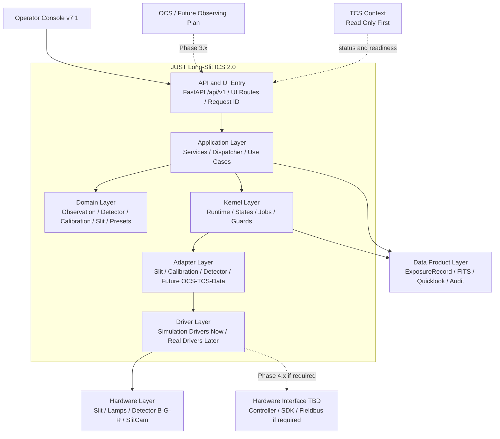
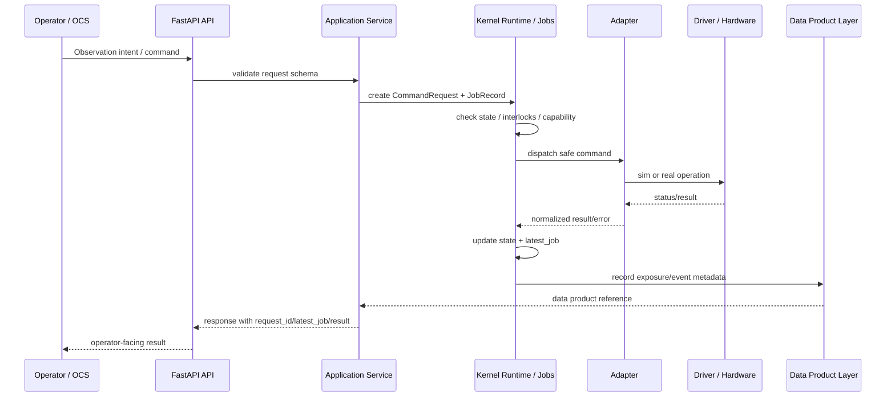
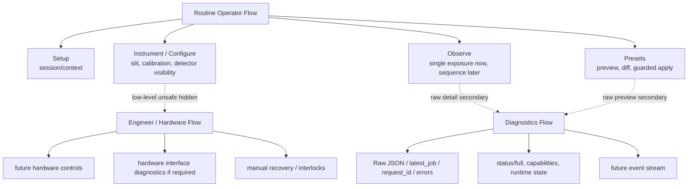

# JUST Long-Slit ICS 2.0 软件开发战略

```text
文档日期: 2026-05-11
建议文件名: docs/ics2_software_development_strategy.md
版本: v2026.05.11-r2
状态: Phase 2.8-I/J merged baseline; technology-adoption gate added
适用范围: JUST 长缝光谱仪 ICS 2.0 软件主线开发
```

## 1. 战略定位

JUST Long-Slit ICS 2.0 是 JUST 长缝光谱仪的软件控制骨架。它的定位不是“一个网页 GUI”，也不是“单个硬件驱动程序”，而是位于观测控制、望远镜状态、仪器机构、探测器、定标系统、数据产品之间的仪器控制系统。

当前主线已经明确：项目采用 simulation-first、API-first、分层架构、操作可审计、前端渐进式迁移、后续真实硬件集成的路线。Phase 2.8-I/J 已完成并合并，`/ui` 已默认进入 v7.1 operator-console prototype，v5 作为 fallback 保留。

ICS 2.0 的长期目标是：

```text
让 OCS / operator / future scripts 能以统一、可审计、可恢复的方式提交观测意图；
让 ICS 将观测意图转化为安全的仪器动作、状态机流转和数据产品记录；
让真实硬件接入之前，模拟链路已经具备可验证的端到端控制语义；
让真实硬件接入之后，系统仍然保持清晰边界、可回退、可诊断、可扩展。
```

## 2. 软件边界

### 2.1 ICS 负责什么

ICS 2.0 应负责：

```text
- 暴露稳定的 /api/v1/* 控制与状态接口；
- 维护仪器状态、曝光状态、子系统状态和 latest_job / request_id 审计链；
- 管理 slit、calibration、detector、presets、observation 等仪器控制语义；
- 提供 operator console，用于 routine observing、diagnostics、future engineer views；
- 通过 adapter/driver 边界接入模拟硬件与未来真实硬件；
- 将观测动作、观测结果、数据产品元数据和错误记录统一表达；
- 为 OCS、TCS、data product、quicklook、sequence runner、真实硬件集成预留合同。
```

当前代码已经具备这些基础：FastAPI 主应用有全局 `X-Request-ID` middleware、统一异常处理、`/api/v1/*` router 接入以及多版本 UI route 管理；PR #10 后 `/ui` 已默认进入 v7.1 operator-console prototype，`/ui/v5` 和 `/ui/legacy` 保留 v5 fallback，v7 runtime 仍保持环境变量显式 opt-in。

### 2.2 ICS 不负责什么

ICS 2.0 不应越界承担以下职责：

```text
- 不负责改变光谱仪的光学分辨率本身；
- 不负责替代 OCS scheduler 或完整观测计划系统；
- 不负责替代 TCS 控制望远镜、调焦、转台、圆顶等；
- 不负责在 routine operator UI 中暴露任何底层总线、PLC、motion-controller 或厂商 SDK 级控制；
- 不负责完整科学数据处理和光谱归约；
- 不负责在无硬件环境下伪造真实硬件 telemetry；
- 不负责把 placeholder 包装成 production capability。
```

例如，`R >= 1000 @ 1 arcsec`、可调分辨率、波长覆盖、线性色散等是光学和仪器设计约束。软件可以记录配置、校验状态、保存 FITS header、触发定标、辅助 QA，但软件本身不能“实现”光谱分辨率。

底层硬件通信协议不在当前软件阶段预先指定。真实硬件未来可能使用串口、USB、以太网、厂商 SDK、PLC/fieldbus、EPICS IOC 或其他控制接口；ICS 2.0 的战略目标是保留 adapter/gateway 边界，而不是提前把任何具体协议写成路线图主轴。

## 3. 技术采纳门槛

任何新技术、协议、数据库、消息系统、实时框架、硬件总线、外部平台进入主路线图前，必须通过 Technology Adoption Gate。

```text
1. 它解决的当前项目问题是什么？
2. 这个问题是否已经在当前 phase 出现？
3. 是否有真实硬件、真实运维、真实接口合同支撑？
4. 是否可以先用更简单的 schema / simulator / file contract / adapter 解决？
5. 是否破坏当前 Domain / Kernel / Application / Adapter 分层？
6. 是否会让 routine operator UI 暴露底层工程复杂度？
7. 是否能被 pytest 或 integration test 覆盖？
8. 如果不用它，当前 phase 是否仍可推进？
```

判定规则：

```text
- 如果第 2、3、7 项不能回答清楚，不进入当前 phase。
- 如果只是未来可能需要，写成 TBD 或 candidate。
- 如果只是底层实现可能性，写成 adapter/gateway boundary。
- 战略文档优先写能力合同，不预设实现技术。
```

这条规则适用于硬件总线，也适用于 WebSocket、FITS writer、SQLite/session persistence、Prometheus、权限系统、自动恢复、复杂 detector write UI 等可能过早引入的技术点。

## 4. 当前主线基线

### 4.1 路由和 UI 基线

当前主线 UI 路由为：

```text
/ui        -> v7.1 default operator-console prototype
/ui/v7     -> v7.1 explicit operator-console prototype
/ui/v5     -> v5 stable legacy fallback
/ui/legacy -> v5 stable legacy fallback alias
/ui/v6     -> v6 operational-status review shell
```

这不是“v7 已经产品级 GUI”的声明，而是默认入口迁移。v7 runtime 仍默认关闭，模块级 runtime 仍需显式环境变量启用。

v7.1 当前信息架构为：

```text
Setup
Instrument / Configure
Observe
Presets
Diagnostics
Housekeeping
Engineer
```

核心原则是：

```text
HTML owns durable structure.
Runtime JS enhances durable HTML skeletons.
```

### 4.2 后端 API 基线

当前 backend 已有这些主要接口：

```text
GET  /api/v1/health
GET  /api/v1/status
GET  /api/v1/status/full
GET  /api/v1/capabilities

POST /api/v1/slit
POST /api/v1/slit_angle

GET  /api/v1/calibration/status
POST /api/v1/calibration/mode
POST /api/v1/calibration/lamp

GET  /api/v1/detector/config
POST /api/v1/detector/config

GET  /api/v1/observation/status
POST /api/v1/observation/arm
POST /api/v1/observation/start
POST /api/v1/observation/finish
POST /api/v1/observation/stop_readout
POST /api/v1/observation/abort_discard

GET  /api/v1/presets
POST /api/v1/presets/preview
POST /api/v1/presets/apply
```

Observation router 当前覆盖 single-exposure lifecycle：status、arm、start、finish、stop_readout、abort_discard。Presets router 当前覆盖 catalog、preview、guarded apply，并对 confirmation-required 和 invalid-state 场景保留 API 级保护。Health router 当前提供 health、status、status/full、capabilities。

### 4.3 Kernel / Runtime 基线

当前 runtime 已经具备：

```text
- RunMode: sim / real
- system/slit/lamps/detector/health 子系统状态聚合
- exposure_state 聚合
- latest_job 查询
- capabilities map
- SIM adapter 装配
- REAL adapter NotImplemented 边界
```

这说明项目已经有清晰的 simulation-first 骨架，但真实硬件 adapter 还没有进入主流程。

Job 层已经能记录 command request、job status、accepted/running/succeeded/failed/aborted、state_before/state_after、result、error 等信息。Dispatcher 层把 command 映射到 handler，并将 invalid param / invalid state / unsupported 作为 non-fault rejection 处理，而不是一概把系统打入 FAULT。

## 5. 已完成的关键工作

### Phase 2.6：GUI 与运行状态基础

完成了 `/api/v1/status/full`、operational status 思路、v6 review shell、v5 adapter、UI safety switches 和 X-Request-ID / latest-job 方向。

### Phase 2.7：Preset operational hardening

完成了 preset category / risk_level / requires_confirmation、side-effect-free preview、guarded apply、latest-job linkage。Preset 已从“配置快捷方式”变成可审计操作单元。

### Phase 2.8-G：v7 runtime 架构稳定

完成了 v7 runtime master gate、模块级 runtime gates、status/preset/observe/guard runtime 的 skeleton-aware 化。核心原则确立为静态 HTML 拥有 durable structure，runtime 只增强。

### Phase 2.8-H：v5 到 v7 的 feature parity pass

完成 v7.1 IA、Instrument / Configure 页面、feedback rail、Observe Finish baseline、Instrument API alignment、slit arcsec/um dual-unit correction。P0/v5 slit-width 单位合同被保留下来，即：

```text
1 arcsec = 128.34 um
operator unit = arcsec
backend command unit = um
```

### Phase 2.8-I/J：command feedback unification 与 v7 default route switch

当前最新完成项：

```text
Phase 2.8-I:
  Instrument / Observe / Presets / Feedback rail / Diagnostics 统一 command-feedback vocabulary:
    last_command
    request_id
    latest_job
    last_error
    result_summary
    raw_json

Phase 2.8-J:
  /ui 默认进入 v7.1 operator-console prototype
  /ui/v5 和 /ui/legacy 保留 v5 fallback
  /api/v1/* 行为不变
  v7 runtime 默认仍关闭
```

该阶段已合并到 main，并由本地 `pytest -q` 验证 161 passed。

## 6. 当前能力分级

| 能力 | 当前状态 | 策略判断 |
|---|---|---|
| 分层架构 | 已成型 | 继续保持 Domain / Kernel / Application / API / UI / Adapter 边界 |
| Request ID / Job audit | 已成型 | 后续 OCS、sequence、data product 都必须沿用 |
| Observation single exposure | 已可用 | 短期继续作为 Observe 的核心，不急于强行做完整 sequence runner |
| Preset preview/apply | 已可用 | 下一步需要 operator-facing diff polish |
| v7 default UI | 已切换 | 是默认 prototype，不是 final GUI |
| v7 runtime | 默认关闭 | 保持显式 opt-in，避免扩大控制面 |
| Slit control | 基础可用 | arcsec/um 双单位合同必须固定 |
| Calibration | 基础可见/可控 | 后续需区分 lamp/source/path/mirror，不要简化成 lamp on/off |
| Detector config | 可见，部分可写 | routine UI 不应急着开放复杂 detector write |
| B/G/R channels | UI 和 config 级别可见 | 真实三通道硬件控制是后续硬件集成 |
| OCS | 未实现 | Phase 2.9 先定义合同，Phase 3.x 再接 adapter |
| TCS | 未实现 | 先做 read-only status/readiness，不做 slew/focus 控制 |
| FITS/data product | 未实现 | 先定义 ExposureRecord/DataProduct contract，再做 writer |
| Slit monitor/guider | 未实现 | 保留 visible placeholder，后续接 image feed |
| 底层硬件通信协议 | 未确定 | 由真实硬件选型决定；当前只保留 adapter/gateway 边界，不预设具体协议 |
| Auth/role gating | 未实现 | 产品化前必须补，但不应早于核心 workflow contract |

## 7. 逻辑架构



这个图的关键点是：OCS/TCS/Data Product/未来硬件接口都不应该绕过 Application/Kernel 直接进入 UI 或硬件。所有命令必须穿过统一的状态、审计、错误和安全边界。底层硬件通信协议保持 TBD，由真实硬件选型反向驱动。

## 8. 数据与控制流目标



目标不是让每个按钮直接控制硬件，而是让每个操作都成为可追踪、可恢复、可解释的 command lifecycle。

## 9. 产品级目标定义

ICS 2.0 达到产品级，并不意味着“没有任何 bug”。更实际的定义是：

```text
- routine observing 可以通过 v7 operator console 完成；
- OCS 可以提交观测请求，并查询状态和结果；
- TCS 状态可以进入 readiness 判断，但早期不由 ICS 控制 TCS；
- 仪器配置、曝光、定标、数据产品和错误都具备统一生命周期；
- 所有高影响操作都有 request_id、latest_job、result_summary、last_error；
- Abort / discard / preset apply / engineering action 有明确 guard；
- 真实硬件接入遵守 adapter contract，不破坏模拟链路；
- 故障可以被检测、隔离、解释，并有人工恢复路径；
- 数据产品至少包含可追溯 metadata、quicklook 入口和后续 FITS/manifest 合同；
- operator flow 和 diagnostics flow 明确分离。
```

最终成熟形态：

```text
OCS / Operator / Future Script
  -> ObservationRequest / ObservationPlan
  -> ICS validation and readiness
  -> SequenceStep execution
  -> Slit / calibration / detector / TCS-readiness coordination
  -> ExposureRecord / DataProduct / Quicklook
  -> Lifecycle event stream
  -> Result callback / audit log
  -> Safe abort and recovery
```

## 10. 技术路线图

### Phase 2.9：Contract Hardening

Phase 2.9 的核心不是“大规模实现”，而是把 Phase 3.x/4.x 需要的合同定稳。

#### 2.9-A：Observation contract

产物：

```text
ObservationRequest
ObservationPlan
SequenceStep
ExposureSpec
AbortPolicy
RecoveryPolicy
ObservationLifecycle
```

要求：

```text
- 可 validate；
- 可 dry-run；
- 可 preview；
- 不直接执行完整 sequence；
- 不接真实 OCS；
- 不接真实 TCS；
- 不引入硬件依赖。
```

#### 2.9-B：Event and command feedback contract

产物：

```text
EventEnvelope
CommandResultEnvelope
LifecycleEvent
ErrorEnvelope
```

统一字段：

```text
event_id
request_id
observation_id
command_id
job_id
source
severity
timestamp
state_before
state_after
result_summary
error_code
payload_ref
```

这将把现在 UI 里的 command feedback vocabulary 提升到后端合同层。

#### 2.9-C：TCS / Observatory context schema

产物：

```text
TcsStatus
ObservatoryContext
ReadinessStatus
```

早期只读字段：

```text
connected
stale
tracking_state
target_name
ra_dec
alt_az
rotator_angle
focus_position
focus_validity
weather_ok
dome_ready
telescope_ready
last_updated
```

明确不做：

```text
- 不 slew；
- 不 focus adjustment；
- 不 rotator command；
- 不 dome command；
- 不伪造真实 telescope telemetry。
```

#### 2.9-D：Data product contract

产物：

```text
ExposureRecord
FrameRecord
DataProductRef
QuicklookRef
FitsHeaderSummary
QualityFlag
SequenceManifest
```

目标是先把“曝光成功”和“数据产品存在”区分开。当前 `ObservationStatusResponse` 已有 `observation_meta`、`frame_results` 等字段雏形，但还不是完整持久化数据产品系统。

#### 2.9-E：Operator workflow polish

重点：

```text
- Presets preview 从 raw JSON 走向 operator-facing diff；
- Setup 明确 local placeholder / persisted contract / runtime-derived；
- Diagnostics 成为 raw payload、runtime、request、latest_job、error 的主入口；
- Instrument / Observe / Presets 的 busy / blocked / error / result visual language 统一。
```

### Phase 3.x：Simulated End-to-End Observatory Workflow

Phase 3.x 才开始把“合同”变成“端到端模拟观测系统”。

#### Phase 3.0：Sequence Runner MVP

```text
- ObservationPlan -> SequenceStep list；
- dry-run -> execute；
- step result history；
- pause / abort / fail / recover；
- simulator-backed only；
- UI Observe 增加 sequence monitor，但保留 single-exposure baseline。
```

#### Phase 3.1：OCS Adapter MVP

```text
POST /api/v1/ocs/observations
GET  /api/v1/ocs/observations/{observation_id}
POST /api/v1/ocs/observations/{observation_id}/abort
GET  /api/v1/ocs/events
```

关键原则：

```text
- OCS adapter 接收观测意图；
- ICS 负责 validation/readiness/sequence execution/status/result；
- OCS 不直接控制硬件；
- idempotency key 和 request_id 必须进入审计链。
```

#### Phase 3.2：TCS read-only sync

```text
- TCS simulator adapter；
- recorded JSON replay adapter；
- real read-only adapter；
- readiness rules；
- v7 status visibility。
```

只读优先，不做望远镜控制。

#### Phase 3.3：Data product / quicklook backend

```text
- ExposureRecord；
- file watcher；
- quicklook placeholder/latest image；
- FITS header summary；
- B/G/R frame mapping；
- data product status；
- quality flags。
```

FITS writer 可以在这一阶段开始，但应服务于真实数据产品合同，不要先写孤立的 FITS demo。

#### Phase 3.4：Realtime event push, if still justified

```text
- SSE or WebSocket, after EventEnvelope is stable；
- lifecycle events；
- command result events；
- observation step updates；
- status freshness；
- polling fallback。
```

实时推送不宜早于 EventEnvelope 和 sequence lifecycle 稳定；如果 polling + command feedback 足够支持当前阶段，则继续保留为后续候选。

#### Phase 3.5：v7 production-candidate hardening

```text
- v7 不只是 default prototype，而是 production candidate；
- role boundary 初步进入；
- operator/diagnostics/engineer 信息分区完成；
- theme strategy, if operationally justified；
- local deployment checklist；
- route fallback strategy 保留。
```

### Phase 4.x：Hardware Commissioning

Phase 4.x 是真实硬件接入和现场 commissioning，不是简单地把 simulator 替换为 hardware。

#### Phase 4.0：Hardware adapter contract freeze

```text
SlitAdapter
CalibrationAdapter
DetectorAdapter
SlitMonitorAdapter
TcsAdapter
SafetyInterlockAdapter
PowerAdapter, if required
HardwareGatewayAdapter, if required
VendorSdkAdapter, if required
FieldbusAdapter, if required
```

每个 adapter 必须有：

```text
sim implementation
real implementation placeholder
capabilities
health/status
command API
abort/stop behavior
timeout policy
error mapping
recovery behavior
tests
```

#### Phase 4.1：Slit / calibration bring-up

```text
- Engineer-only first；
- hardware-in-loop tests；
- interlock；
- timeout；
- position verification；
- command/result audit；
- manual recovery。
```

#### Phase 4.2：Detector B/G/R bring-up

```text
- read-only status；
- config read-only；
- test exposure；
- dark/bias；
- science exposure；
- readout；
- data product registration；
- quicklook。
```

#### Phase 4.3：Slit monitor / guider integration

```text
- latest frame；
- slit region visualization；
- target-on-slit；
- slit-width measurement；
- guide offset suggestion；
- operator-confirmed correction。
```

自动闭环应放到很后面，不能早期直接启用。

#### Phase 4.4：Hardware communication and realtime feedback integration, if required

真实硬件通信协议不在软件阶段预先指定。Phase 4.x 根据最终硬件、控制器、厂商 SDK、PLC/fieldbus 架构和现场 commissioning 需求决定接入方式。若硬件确实使用某种 fieldbus、motion controller、PLC、EPICS IOC、串口、USB、以太网或厂商 SDK，ICS 只通过 adapter/gateway 进入，不让 routine operator UI 直接面对底层接口。

```text
Engineer-only first
sim parity required
safe stop verified, if applicable
watchdog verified, if applicable
hardware map documented
fault mapping stable
no browser-to-hardware direct control
```

#### Phase 4.5：Nightly commissioning

```text
- daytime checkout；
- night startup；
- calibration sequence；
- science sequence；
- abort/recovery drill；
- data product verification；
- operator checklist；
- incident log。
```

## 11. 工作优先级

### P0：现在到 Phase 2.9 必须推进

```text
1. 纠正文档中过时或过度技术预设的表述
2. ObservationPlan / SequenceStep / EventEnvelope / DataProduct / TcsStatus 合同
3. Presets operator-facing diff polish
4. Setup session metadata contract
5. Diagnostics command-feedback consolidation
6. 保持 pytest -q 绿色
```

### P1：Phase 3.0–3.2 推进

```text
1. Sequence Runner MVP
2. OCS Adapter MVP
3. TCS read-only sync
4. Data product / quicklook backend
5. Observation lifecycle event query
```

### P2：Phase 3.3–3.5 推进

```text
1. Realtime event push, if EventEnvelope and sequence lifecycle justify it
2. v7 production-candidate hardening
3. role/permission boundary
4. persistent observation log
5. monitoring/metrics, if operational deployment requires it
```

### P3：Phase 4.x 推进

```text
1. real slit/calibration hardware
2. detector B/G/R bring-up
3. slit monitor / guider
4. hardware communication protocol validation
5. low-level realtime feedback, if required by selected hardware
6. commissioning checklists and drills
```

## 12. 硬件现实约束

后续所有软件设计必须遵守以下原则：

```text
软件只表达、验证、记录和协调仪器能力；
软件不能伪造硬件能力；
软件不能替代光学设计；
软件不能越过 adapter/safety/kernel 直接控制硬件；
软件不能让 operator UI 暴露未验证的低层工程控制；
软件必须把 unavailable / stale / simulated / real 清楚显示。
```

具体到 P0 约束：

```text
- B/G/R 三通道必须始终按 JUST 模型表达，不能退化为 Blue/Red 两通道；
- slit width 控制必须保留 arcsec 和 um 双单位；
- 1 arcsec = 128.34 um 是软件控制合同；
- calibration 不只是 lamp on/off，还包括 source、mode、path、mirror 等后续合同；
- slit monitor / guider 是一等子系统，不应从 UI 架构中消失；
- TCS context 是 readiness 的组成部分，但早期只读；
- 底层通信协议由硬件选型决定；当前阶段不预设任何具体 fieldbus 或厂商接口。
```

## 13. 短期行动清单

### 立即行动 1：文档卫生与技术采纳门槛

目标：

```text
- README / project_status / operator_console_requirements / strategy 中的当前状态保持一致；
- 删除或降级未被硬件事实支撑的具体技术名词；
- 加入 Technology Adoption Gate；
- 保持 docs/project_status.md 作为阶段状态源；
- 保持 docs/operator_console_requirements.md 作为硬件/需求边界源。
```

验收：

```text
pytest -q
文档 route 描述与 main.py 一致
没有把未定技术写成既定路线
```

### 立即行动 2：Phase 2.9-A 合同包

目标：

```text
- 定义 ObservationPlan / SequenceStep / ExposureSpec；
- 定义 EventEnvelope / CommandResultEnvelope；
- 定义 DataProductRef / ExposureRecord；
- 定义 TcsStatus / ObservatoryContext；
- 加 schema/domain unit tests；
- 不接真实 OCS/TCS/hardware。
```

验收：

```text
合同可单元测试
无 runtime 行为破坏
无新 UI 假 telemetry
```

### 立即行动 3：Presets diff polish

目标：

```text
- 把当前 PresetPreviewResponse 中的 changes 显示成 operator-facing diff；
- 按 detector_config_changes / calibration_changes / slit_changes 分组；
- 明确 risk_level、requires_confirmation、blocked_reason；
- raw JSON 保留在 details 或 Diagnostics。
```

### 立即行动 4：Setup session metadata contract

目标：

```text
- 先定义 session metadata 字段和生命周期；
- 不急着引入 SQLite；
- 不急着做复杂恢复；
- 明确 local placeholder / future persisted / runtime-derived。
```

优先级低于 ObservationPlan 和 EventEnvelope，但应在 v7 production-candidate 之前完成。

## 14. 成功标准

短期成功：

```text
- README / docs / main.py route 描述一致；
- pytest -q 持续绿色；
- Phase 2.9 contract 进入代码或文档并有测试；
- Presets diff 可读；
- v7 作为默认入口不扩大 runtime 控制面；
- 新技术名词进入路线图前通过 Technology Adoption Gate。
```

中期成功：

```text
- simulated ObservationPlan 可 dry-run / execute；
- sequence step 有生命周期；
- OCS adapter 可提交 observation request；
- TCS read-only status 可参与 readiness；
- ExposureRecord / DataProductRef 可记录；
- quicklook/latest exposure contract 可用。
```

长期成功：

```text
- 真实 slit/calibration/detector hardware adapter 可逐步替换 simulator；
- B/G/R exposure/readout/data product loop 可 commissioning；
- slit monitor / guider 可进入 operator workflow；
- 底层硬件通信由真实硬件选型驱动，并被 adapter/gateway 边界隔离；
- 夜间 checkout、abort/recovery、incident logging 可操作。
```

## 15. Mermaid：阶段推进图


## 16. Mermaid：能力分区图



## 17. 最终战略判断

ICS 2.0 当前已经越过“原型是否合理”的阶段，进入“控制系统骨架如何产品化”的阶段。现在最重要的不是马上堆 OCS/TCS/FITS/硬件总线功能，而是把合同、状态、事件、观测计划、数据产品和 UI 责任边界定稳。

最稳妥的推进顺序是：

```text
1. 文档卫生和技术采纳门槛落地；
2. Phase 2.9 contract hardening；
3. Presets diff 和 Setup session contract；
4. Sequence runner simulator MVP；
5. OCS adapter；
6. TCS read-only；
7. Data product / quicklook；
8. Realtime event push, if justified；
9. v7 production-candidate hardening；
10. Phase 4.x 真实硬件 commissioning。
```

这一路线既保留了当前架构的优势，也避免了两个常见风险：

```text
- 把光学/硬件能力错误归因给软件；
- 在合同未稳定、硬件未定型前过早指定实现技术。
```
